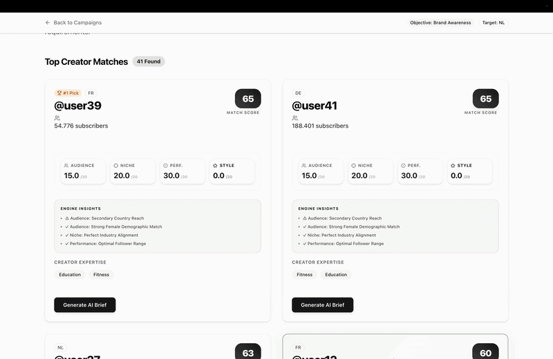
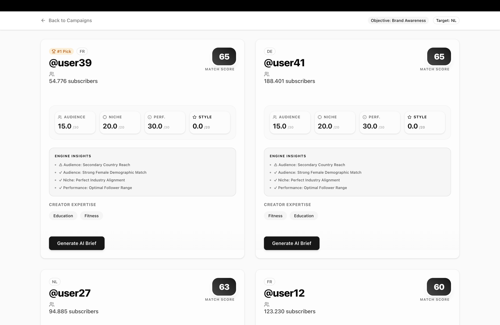
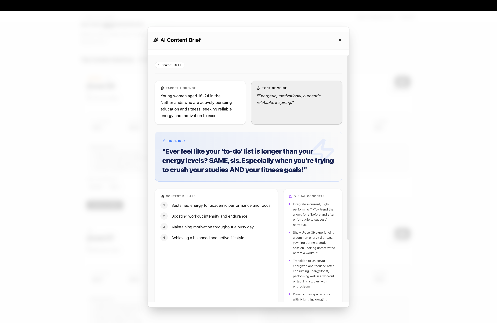

# Wayv Agency - Creator Matching MVP

## 🌐 Canlı Demo
Projenin canlı versiyonuna buradan ulaşabilirsiniz: [https://core-matching-engine-ai-brief-gener.vercel.app/](https://core-matching-engine-ai-brief-gener.vercel.app/)

## ✨ Görsel Önizleme

<div align="center">
  
</div>

<br />

<div align="center">
  <table width="100%">
    <tr>
      <td width="50%" align="center">
        
        <br />
        <b>🧠 Engine Insights:</b> Skorlama mantığının şeffaf raporlaması.
      </td>
      <td width="50%" align="center">
        
        <br />
        <b>✍️ AI Strategy:</b> Gemini tarafından üretilen içerik brief'i.
      </td>
    </tr>
  </table>
</div>

## 🚀 Proje Hakkında
Bu proje, Wayv Agency için geliştirilmiş AI Destekli Creator Eşleştirme Motorudur (Matching Engine). Next.js, tRPC, Prisma ve Vercel AI SDK (OpenAI) kullanılarak MVP (Minimum Viable Product) olarak tasarlanmıştır.

## 🛠️ Kurulum Adımları
1. Projeyi klonlayın ve klasöre gidin:
   ```bash
   cd wayv-matching-mvp
   ```
2. Bağımlılıkları yükleyin:
   ```bash
   npm install
   ```
3. Çevresel değişkenleri ayarlayın. Kök dizinde oluşturulmuş `.env` dosyasını bulun:
   ```env
   # Veritabanı (Supabase PostgreSQL örneği)
   DATABASE_URL="postgres://..."
   DIRECT_URL="postgres://..."

   # AI - Google Gemini (Native SDK)
   GOOGLE_GENERATIVE_AI_API_KEY="AIzaSy..."
   ```
4. Veritabanını Senkronize Edip Verileri İçeri Aktarın:
   ```bash
   npx prisma db push
   npx prisma db seed
   ```
5. Projeyi başlatın:
   ```bash
   npm run dev
   ```
6. Tarayıcınızda `http://localhost:3000` adresine gidin.

## 🧮 Skorlama Mantığı (Score Breakdown)
Kampanya ve İçerik Üreticisi (Creator) eşleştirmesi 100 üzerinden değerlendirilir ve algoritma şu şekilde ağırlıklandırılmıştır:

1. **Brand Safety (Hard Constraint - Eleme Kriteri):**
   - EĞER kampanyanın "Yasaklı Kelimeleri" (`doNotUseWords`) creator'ın "Sınır İhlali" (`brandSafetyFlags`) kurallarıyla eşleşiyorsa, o creator **anında elenir** ve eşleşme havuzundan çıkarılır.
2. **Niche Match (Niş Uyumu - Maks 40 Puan):**
   - Kampanyanın ilgilendiği nişlerle, creator'ın yetenek/niş ortak noktalarına göre oranlanarak hesaplanır. En yüksek ağırlık buradadır.
3. **Audience Match (Kitle Uyumu - Maks 30 Puan):**
   - Kampanyanın hedef ülkeleri, yaş aralığı ve cinsiyet kırılımlarının creator'ın kitlesiyle uyuşma oranına göre kademeli bir puan verilir.
4. **Content Style & Performance Match (Tarz ve Performans Uyumu - Maks 30 Puan):**
   - Creator'ın favori 'Hook' tipi (örn: Soru sorma, şok edici giriş) ve genel içerik tarzının markanın vizyonuyla uyuşmasına bakılır. Beraberinde etkileşim oranı (engagement rate) gibi metriklerle desteklenir.

## 💡 AI Entegrasyonu & Özellikler
- **Native Google Gemini SDK:** Vercel AI SDK adaptör katmanındaki API Key çakışmalarını aşmak ve tam performans almak için sistem doğrudan Google'ın resmi `@google/genai` kütüphanesi ile yazılmıştır.
- **Structured Output (JSON Schema):** Model olarak `gemini-2.5-flash` kullanılmış ve LLM'in `responseSchema` parametresi ile Zod benzeri kesin ve hatasız bir JSON objesi dönmesi donanımsal olarak garanti altına alınmıştır.
- **Cache Stratejisi:** Oluşturulan AI Brief'leri, tekrar API maliyeti yaratmamak ve saniyesinde sonuç göstermek için Supabase'de (`BriefCache` tablosunda) tutulmaktadır. Sistem önce cache'i yoklar, cevabı oradan dönerse UI'a sonucu anında yansıtır.

## 🚧 Trade-off'lar ve Geliştirme Notları
- **Supabase PostgreSQL & Native Array'ler:** İlk MVP aşamasında hızlı iterasyon için veritabanında JSON stringleri kullanılmıştı. Ancak daha sonra mimari, ölçeklenebilir bir Supabase PostgreSQL ağına taşındı. `niches`, `brandSafetyFlags` gibi alanlar JSON formatından çıkarılıp native PostgreSQL dizilerine (`String[]`) dönüştürüldü. Bu, Tip Güvenliğini (Type Safety) sağladı ve CPU üzerindeki gereksiz `JSON.parse` yükünü ortadan kaldırdı.
- **Minimalist ama Premium UI:** Tasarıma harcanacak efor, eşleştirme motoru (matching engine) ve yapay zeka prompting algoritmalarına kaydırıldı. UI tarafında `Shadcn UI` ve `Framer Motion` kullanılarak erişilebilirlik standartlarına uygun, dark-mode odaklı ve glassmorphism detayları barındıran "premium" bir hissiyat yaratıldı.
- **N-N İlişkiler Yerine Array Kullanımı:** Çok büyük ölçekli kurumsal yapılarda Nişler veya Yasaklı Kelimeler ayrı Join (ara) tablolarında tutulur. Ancak bu MVP'de, hızlı okuma performansı ve basitlik (simplicity) adına native PostgreSQL Array tipleri tercih edilmiştir. Bu, projenin mevcut ölçeği için mükemmel bir hız trade-off'udur.

Wavy Ekibine sevgilerle. 🌊

---

## 🗺️ Roadmap & Gelecek Planları
Projenin ölçeklenebilirliğini ve kurumsal yeteneklerini artırmak için planlanan geliştirmeler:

- [ ] **Multi-Model LLM Orchestration:** Sadece Gemini değil; OpenAI (GPT-4o) ve Anthropic (Claude 3.5) modellerini hıza ve maliyete göre otomatik seçen bir orkestrasyon katmanı.
- [ ] **Real-time Social Signals:** Creator verilerini manuel girmek yerine, TikTok ve Instagram API'leri üzerinden canlı izlenme ve kitle verilerinin çekilmesi.
- [ ] **Export to PDF/Deck:** Markalar için üretilen strateji ve brief'lerin tek tuşla profesyonel PDF sunumlarına dönüştürülmesi.
- [ ] **Advanced Scoring:** Görüntü işleme (Computer Vision) kullanarak creator'ın video estetiğinin markanın renk paletiyle uyumunun ölçülmesi.
